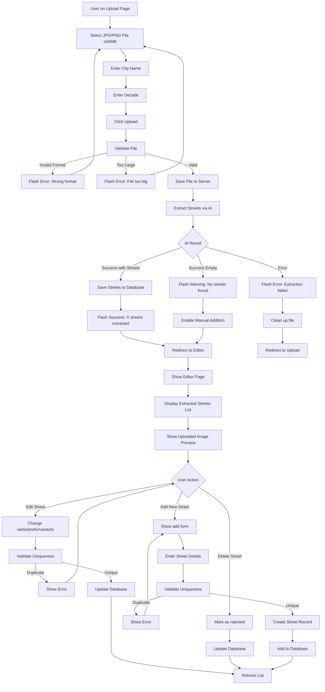

# Główny Flow Aplikacji: Upload → Ekstrakcja → Edycja

Diagram przepływu dla historyjek US-003, US-004, US-005, US-006 zaimplementowanych w aplikacji Streets Dictionary Editor.

## Opis Kluczowych Kroków:

### Walidacja Pliku
- Sprawdzenie formatu (tylko JPG/PNG)
- Sprawdzenie rozmiaru (≤50MB)
- Implementacja w `file_handler.py`

### Ekstrakcja AI
- Wywołanie Gemini 2.5 Pro przez OpenRouter
- Timeout 5 minut
- Obsługa błędów i pustych wyników
- Implementacja w `ai_extraction.py`

### Zapisywanie do Bazy
- Tworzenie obiektów Street dla każdej ulicy
- Transakcyjne zapisywanie (commit/rollback)
- Implementacja w `upload.py`

### Edycja
- AJAX endpoints dla edycji ulic
- Walidacja unikalności nazw
- Implementacja w `upload.py` (API routes)

## Zaimplementowane User Stories:
- **US-003**: Upload skanu
- **US-004**: Uruchomienie ekstrakcji
- **US-005**: Obsługa pustego wyniku
- **US-006**: Edycja wpisu
- **US-007**: Dodanie nowej ulicy
- **US-008**: Walidacja unikalności

## Techniczne Szczegóły:
- **Framework**: Flask z SQLAlchemy
- **Baza**: SQLite z Flask-Migrate
- **Frontend**: Jinja2 templates + Vanilla JS
- **AI**: OpenRouter API + Gemini 2.5 Pro
- **Stylizacja**: Tailwind CSS
